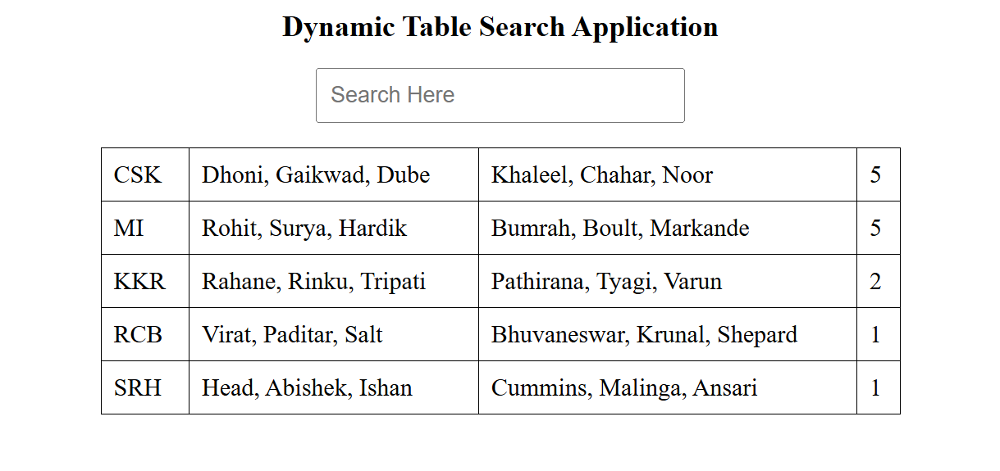

# Dynamic Table Search Application

A simple and interactive web application built using HTML, CSS, and JavaScript. The application displays cricket team data in a structured table and allows users to search and filter records dynamically, demonstrating JavaScript array manipulation, event handling, DOM manipulation, and real-time search functionality.

## Key Highlights

- Dynamic Table Search Application
- Real-Time Data Filtering
- Interactive Search Functionality
- JavaScript Array Manipulation
- DOM Manipulation
- Lightweight and Fast Loading

## Repository

GitHub Repository:

```text
https://github.com/Teja2037/dynamic-table-search-application
```

## Features

### Data Management

- Display cricket team information in a structured table
- Organize data in a readable format
- Dynamically update table content
- Handle multiple records efficiently

### Search Functionality

- Real-time search and filtering
- Instant result updates
- User-friendly search interface
- Dynamic content rendering

### User Experience

- Simple and intuitive interface
- Fast filtering performance
- Responsive data display
- Beginner-friendly design
- Lightweight application

## Technologies Used

- HTML5
- CSS3
- JavaScript (ES6)

## Project Structure

```text
dynamic-table-search-application/
│
├── table.html
├── filter.js
├── README.md
│
└── Image/
    └── screenshot.png
```

## How to Run

1. Clone the repository

```bash
git clone https://github.com/Teja2037/dynamic-table-search-application.git
```

2. Open `table.html` in any modern web browser.

3. Enter a keyword in the search box.

4. View the filtered results instantly in the table.

## Screenshots

### Application Interface



## Purpose

This project was developed to demonstrate front-end web development skills using HTML, CSS, and JavaScript by implementing a dynamic table search application that showcases data filtering, array manipulation, event handling, and real-time search functionality.

## Learning Outcomes

- JavaScript Arrays
- Array Filtering Methods
- Event Handling
- DOM Manipulation
- Dynamic Content Rendering
- Real-Time Search Functionality
- Front-End Development Fundamentals

## Future Improvements

- Add sorting functionality
- Add pagination for large datasets
- Improve UI styling and responsiveness
- Highlight matching search results
- Add advanced filtering options
- Fetch data from external APIs
- Implement dark mode support
- Export filtered results to CSV or Excel

## Author

**Malla Venkata Varun Teja**

B.Tech in Computer Science and Engineering

Aspiring Software Engineer actively seeking opportunities in the IT industry to apply and enhance skills in software development, web technologies, and problem-solving while contributing to innovative projects.

GitHub Profile: https://github.com/Teja2037
